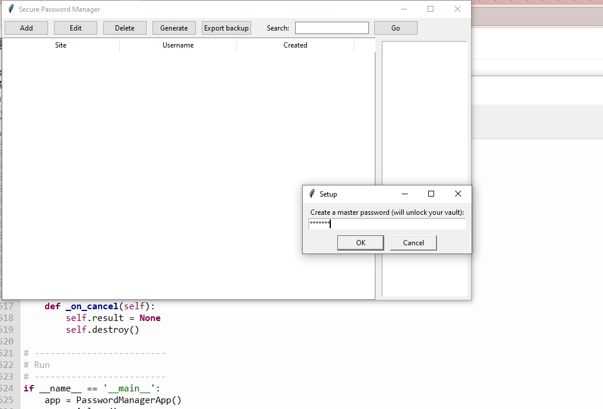
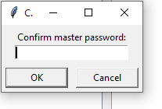
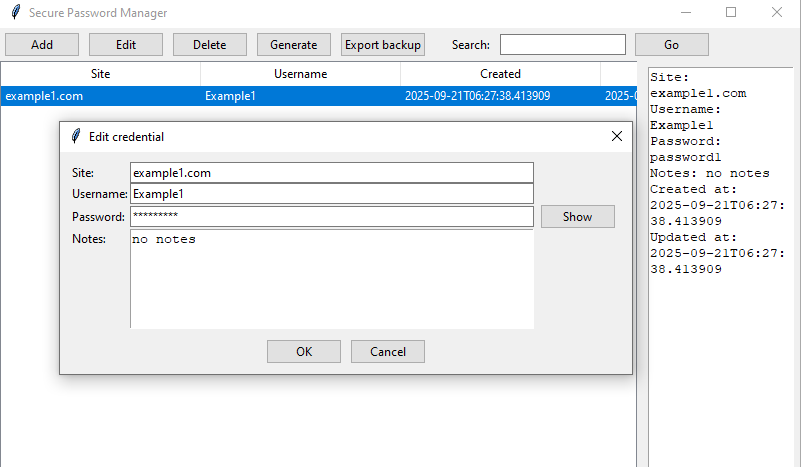
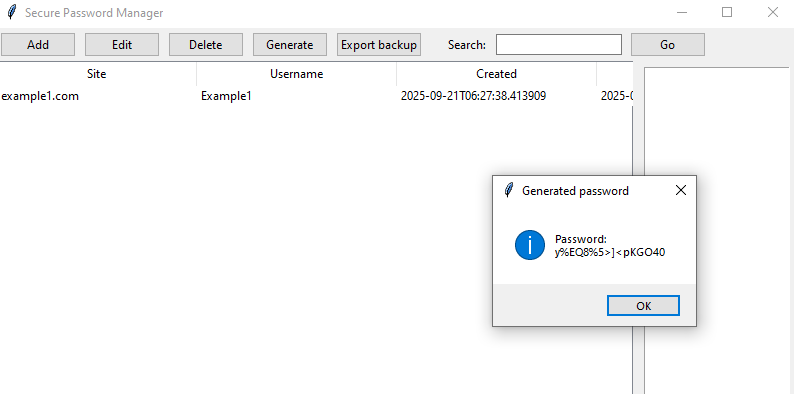
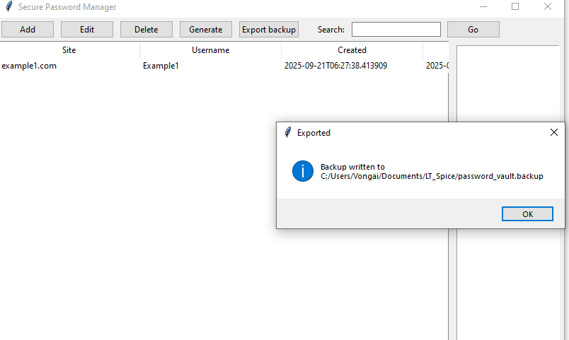
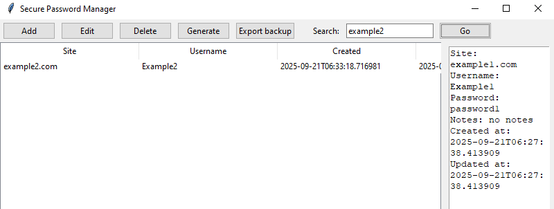

# 1.  README.md with content
cat > README.md << 'EOF'
# 🔐  Password Vault

A secure, local, and open-source password manager built with **Python, SQLite, and Fernet encryption**. It provides a simple **Tkinter GUI** to store, search, and manage credentials offline.

---

## ✨ Features
- Master password to unlock the vault (PBKDF2 key derivation)
- Credentials stored in **SQLite** with encrypted passwords
- Add, edit, delete, and search credentials
- Password generator for strong random passwords
- Export encrypted backup file
- GUI built with Tkinter

---

## 🚀 Getting Started

### 1. Clone Repository
\`\`\`bash
git clone [https://github.com/VongaiWitcho/Password-Vault.git]
cd Password-Vault
\`\`\`

### 2. Install Dependencies
\`\`\`bash
pip install cryptography
\`\`\`

### 3. Run Application
\`\`\`bash
python password_vault.py
\`\`\`

On the first run, you’ll be prompted to create a **master password**. This password encrypts your vault. **There is no recovery if you forget it!**

---

## 📂 Database Schema
- **settings**: stores salt & verifier for master password validation
- **credentials**: stores site, username, encrypted password, notes, timestamps

---

## 🖼️ Screenshots
1. 
2. 
3. 
4. 
5. 
6. 
7. 
8. 

---

## 🛡️ Security Notes
- Passwords are encrypted with **Fernet (AES-128 in CBC with HMAC)**
- Keys are derived with **PBKDF2-HMAC-SHA256** + random salt
- Master password is **never stored**

---

## 📜 License
MIT License. Free to use, modify, and distribute.

---

## 👨‍💻 Author
Developed by Vongai ✨
EOF

